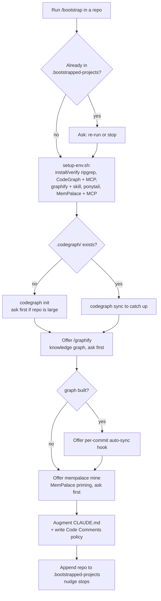

# bootstrap

One command that takes a repo — and a teammate's fresh machine — from nothing to ready for this Claude Code setup. No more "which extensions do I need, and how do I wire them up?" A teammate clones a repo, runs `/bootstrap`, and the toolchain gets installed, configured, indexed, and the repo gets recorded as done. After that, a session-start hook nudges anyone who opens a repo that hasn't been bootstrapped yet, so nobody works in a half-configured project by accident.

## How it works

`/bootstrap` runs a fixed sequence per repo. The setup step installs only what's missing (idempotent — safe to re-run), and the slow steps ask before they run.



Walkthrough: `setup-env.sh` checks each tool with `command -v` and installs the gaps — `brew install ripgrep`, `codegraph` via volta/npm then `codegraph install -y` to wire its MCP, `graphifyy` via uv/pipx then `graphify install` for the skill, the ponytail plugin written into `~/.claude/settings.json`, and `mempalace` via uv/pipx with its MCP registered. Then `/bootstrap` builds the CodeGraph index (asking first on a large repo), optionally builds the graphify graph, and — only if a graph got built — offers a per-commit hook that refreshes it on every `git commit`. It augments the repo's `CLAUDE.md` and, by default, writes the standard `## Code Comments` policy (no comments by default; one-line `why` only) verbatim into `CLAUDE.md` plus any existing `AGENTS.md` / `AGENT.md` (root and nested), then appends the repo path to `~/.claude/.bootstrapped-projects` so the session-start nudge stops firing for it.

Plugins and the CodeGraph MCP only surface after a Claude Code restart — `/bootstrap` says so at the end.

## What you get

| Piece | Role |
|------|------|
| `skills/bootstrap/SKILL.md` | the `/bootstrap` flow Claude runs per repo |
| `skills/bootstrap/setup-env.sh` | idempotent installer for the toolchain — also runnable standalone from a terminal |
| `skills/bootstrap/install-graphify-sync.sh` | wires the per-commit graphify auto-sync hook into a repo's `.claude/` |
| `skills/bootstrap/code-comments.md` | the canonical `## Code Comments` policy block written verbatim into `CLAUDE.md` / `AGENTS.md` / `AGENT.md` |
| `skills/bootstrap/templates/` | the `graphify-sync.sh` / `graphify-sync.py` files that hook copies into a repo |
| `hooks/bootstrap-check.sh` | SessionStart nudge — fires in any project not yet in `.bootstrapped-projects` |
| `install.sh` | symlinks the skill + nudge hook, wires the SessionStart hooks into `settings.json` |

The toolchain it installs:

| Tool | What it is | How it's installed |
|------|-----------|--------------------|
| **ripgrep** | the `rg` binary, fast search | `brew install ripgrep` |
| **CodeGraph** | `@colbymchenry/codegraph` CLI + its MCP server, then a built index of the repo | volta/npm install → `codegraph install -y` → `codegraph init` |
| **graphify** | the `graphifyy` PyPI package (provides the `graphify` CLI, Python 3.10+) + the `/graphify` skill | `uv tool install graphifyy` (or pipx) → `graphify install` |
| **ponytail** | the [ponytail](https://github.com/DietrichGebert/ponytail) plugin — lazy-senior-dev mode (YAGNI, stdlib-first, fewest lines) | marketplace + enable written to `~/.claude/settings.json` |
| **MemPalace** | the [MemPalace](https://github.com/MemPalace/mempalace) memory engine — cross-session memory, verbatim storage, **local embeddings (no API key, no LLM call, no quota)** | `uv tool install mempalace` + `claude mcp add mempalace -- mempalace-mcp` |

## Install — send this README to Claude Code

> **🤖 Claude Code — if a user sent you this README, install it now. Steps:**
>
> 1. **Preflight.** Confirm `git`, `jq`, and the `claude` CLI are on PATH.
> 2. **Clone (idempotent):**
>    ```bash
>    git clone https://github.com/unisol1020/ai-tools.git ~/.ai-tools 2>/dev/null \
>      || git -C ~/.ai-tools pull --ff-only
>    ```
> 3. **Run the installer** (symlinks the `/bootstrap` skill + the nudge hook, wires the SessionStart hooks into `settings.json` — backs it up first):
>    ```bash
>    bash ~/.ai-tools/bootstrap/install.sh
>    ```
>    Add `--with-deps` to also install the toolchain (ripgrep / CodeGraph / graphify / ponytail / MemPalace) right now. **Ask the user first** — it runs brew / npm / uv.
> 4. **Verify:** `ls -la ~/.claude/skills/bootstrap` is a symlink into `~/.ai-tools/bootstrap`.
> 5. **Report back:** tell the user to **restart Claude Code once**, then open any repo and run **`/bootstrap`** — it installs the required extensions if missing, builds the CodeGraph index, offers `/graphify`, and records the repo. The ponytail plugin and the CodeGraph + MemPalace MCPs surface after the restart.
>
> Update later with `git -C ~/.ai-tools pull` — the symlink picks it up.

### Requirements

macOS or Linux, [Claude Code](https://claude.com/claude-code), `git`, and `jq`. For the toolchain: `node`/`npm` (or volta) for CodeGraph, `python3` for graphify, and Homebrew for ripgrep. The installer fills the gaps it can.

### Manual install

```bash
git clone https://github.com/unisol1020/ai-tools.git ~/.ai-tools
~/.ai-tools/bootstrap/install.sh          # add --with-deps to also install the toolchain now
```

Then restart Claude Code.

## Use it

The teammate path, start to finish:

1. Install this once (above), restart Claude Code.
2. Open any repo. Claude nudges you that it isn't bootstrapped.
3. Run **`/bootstrap`**. It installs what's missing, indexes the repo, asks before the slow steps (large-repo indexing, `/graphify`, `mempalace mine`), and records the repo as done.

Want to set the toolchain up from a terminal without opening a repo? Run the bundled script directly — it installs only what's missing:

```bash
bash ~/.claude/skills/bootstrap/setup-env.sh
```

### Per-commit graphify auto-sync

If `/bootstrap` built a graphify graph, it offers a `PostToolUse` hook (written to the repo's `.claude/settings.local.json`). After every `git commit`, the hook runs a silent AST pass that refreshes `graphify-out/graph.json` from the commit's changed code files — zero tokens, the model is never involved. The files land in the repo's `.claude/`, which is personal and gitignored, so it's never imposed on teammates via shared git hooks. Code stays fresh automatically; **doc/README/spec changes still need a manual `/graphify --update`**.

## Privacy

`~/.claude/.bootstrapped-projects` lists the real repo paths you've set up. It lives under `~/.claude` and is never committed to this (or any) repo — only the generic tooling ships here.

## Uninstall

```bash
rm ~/.claude/skills/bootstrap ~/.claude/hooks/bootstrap-check.sh
# then remove the SessionStart entries for bootstrap-check.sh and the codegraph sync from ~/.claude/settings.json
```

## Memory: MemPalace (and migrating off claude-mem)

`setup-env.sh` installs [MemPalace](https://github.com/MemPalace/mempalace) (MIT), registers its MCP
at user scope, and wires four capture hooks into `~/.claude/settings.json`:

| Hook | Effect |
|---|---|
| `SessionStart` | loads relevant memory into the session |
| `Stop` | saves after each turn |
| `SessionEnd` | saves on close |
| `PreCompact` | saves before context compaction |

**Saving and recall are two separate mechanisms — you need both.**

*Saving* is the `Stop` / `SessionEnd` / `PreCompact` hooks. Straightforward.

*Recall* is the part that surprises people. MemPalace's own `session-start` hook injects
**nothing** — read it, it only initialises tracking state and returns `{}`. MemPalace expects the
model to pull memory on demand through MCP tools, whereas claude-mem pushed context in at session
start. So two pieces restore that behaviour:

1. `mempalace-session-start.sh` wraps MemPalace's real hook and appends `mempalace wake-up`
   (~800 tokens of L0/L1 context) as `additionalContext`, so memory reaches every session
   unprompted. It resolves the wing from your git root, so you get *this* repo's memory.

   This only works because the migration mines **one wing per root project**. Mined flat into a
   single wing, `wake-up` ignores your cwd and returns whichever project it feels like — you sit
   in one repo and get another repo's July notes. claude-mem's project scoping was implicit;
   here it has to be built.
2. `mempalace-rules.sh` writes a short block into `~/.claude/CLAUDE.md` telling the model to
   search the palace before answering about past work, quote results verbatim, and say so when
   the palace has nothing rather than guessing.

Without (1) nothing is recalled automatically. Without (2) the model has the tools but no reason
to reach for them. The MCP alone gives you neither.

MemPalace stores verbatim text and embeds locally (`all-MiniLM-L6-v2`). No API key, no
per-session model call, nothing to exhaust — which is why it replaced claude-mem here, whose
observer needs an LLM call per session and fails closed when that allowance runs out.

### Migrating an existing claude-mem database

```bash
bash ~/.claude/skills/bootstrap/mempalace-migrate.sh            # export + mine + hooks
bash ~/.claude/skills/bootstrap/mempalace-migrate.sh --remove-claude-mem   # ...and retire the old plugin
```

| Flag | Effect |
|---|---|
| *(none)* | export → mine → wire hooks. claude-mem left running. |
| `--remove-claude-mem` | disable the plugin + stop its worker. **Database kept.** |
| `--purge-claude-mem` | also `rm -rf ~/.claude-mem`. Irreversible — only after you trust recall. |
| `--skip-mine` | export + hooks only. |
| `--with-cloud` | also install the third-party cloud plugin (see below). |

The export is a read-only SQLite→markdown transform — **no LLM calls, no cost**. Observations are
split into one file per project per month on purpose: MemPalace skips any file over its
per-file chunk cap **silently**, so a single large project file will appear to import and won't.
The migration script surfaces that count; don't ignore it.

Your original transcripts in `~/.claude/projects/` are the higher-fidelity source — claude-mem's
observations are LLM summaries *of* them. To file those verbatim instead:

```bash
mempalace mine ~/.claude/projects/<project-dir> --mode convos
```

### A note on MemPalace Cloud

`cschnatz/mempalace-cloud-plugin` is a **third-party** plugin (not the MemPalace org) that adds
OAuth, multi-device sync and a web UI. It is **not installed by default**, and for good reason:
its hooks auto-save to `https://api.mempalace.cloud/mcp`, **not** your local palace. Running it
alongside the local setup splits memory across two backends, and uploads session content —
including anything work-related — to a third party. Opt in with `--with-cloud` only deliberately.

The open-source core has no web UI. Inspect the palace locally instead:

```bash
mempalace status
mempalace search "what you're looking for"
sqlite3 ~/.mempalace/palace/chroma.sqlite3 \
  "SELECT substr(string_value,1,300) FROM embedding_metadata WHERE key='chroma:document' LIMIT 20"
```
