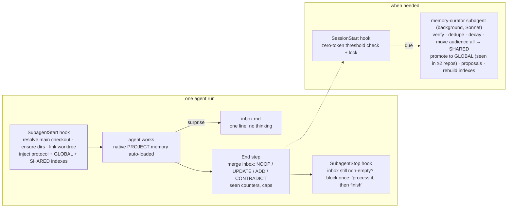

# memory

**Every agent and skill in this kit remembers what it learned, and gets better each time you use it.**

Claude Code subagents start from zero on every run. The `architect` re-discovers the same repo quirks, `manual-qa` re-learns the same login dance, the reviewers re-flag the same false positive. This tool gives each of them a persistent, self-evolving memory with two tiers:

- **PROJECT** — what the agent learned about *this* repo, app and machine. Lives in the repo's main checkout, gitignored, shared by every worktree of that repo.
- **GLOBAL** — best practices that hold in *every* project. Lives in `~/.claude/agent-memory/<agent>/`. Nothing lands here by hand: lessons that recur across repos are promoted by a curator.

Plus a small **SHARED** project memory for cross-agent facts (env quirks, ports, flags) that every agent in the repo reads.

It is built on Claude Code's native subagent memory (`memory:` frontmatter, v2.1.33+) and adds the pieces the native feature lacks: a second tier, worktree safety, capture-on-surprise, counters and decay, automatic consolidation, promotion to global, and a per-run stats line so you can see it working.

## Install

```bash
git clone https://github.com/unisol1020/ai-tools.git ~/.ai-tools 2>/dev/null || git -C ~/.ai-tools pull --ff-only
bash ~/.ai-tools/memory/install.sh
```

Restart Claude Code once. Nothing else to do: the agents (`team/`, `qa/`) and skills already carry their memory instructions, and the hooks wire themselves.

## What you get

After a few runs of any agent in a repo:

```
<repo>/.claude/agent-memory-local/
  architect/    MEMORY.md  mbo-pricing-sync-is-manual.md  supabase-branch-migrations.md  stats.tsv
  manual-qa/    MEMORY.md  login-needs-2fa-bypass-flag.md  admin-port-is-3001.md
  _shared/      MEMORY.md  login-needs-2fa-bypass-flag.md      # moved here: manual-qa tagged it audience: all
  _skills/qa-run/ ...
~/.claude/agent-memory/
  manual-qa/    MEMORY.md  expo-web-needs-viewport-resize-before-screenshot.md   # promoted: seen in 2 repos
  proposals.md                                                                    # "add to CLAUDE.md?" suggestions for you
```

Every agent report ends with `memory: recalled 12 used 3 saved 1 repeats 0`. `repeats` is the number you watch: a mistake repeated despite memory. It should trend to zero.

| Command | What it does |
|---|---|
| `agent-memory status` | this repo's memory: entries, pending lessons, days since last consolidation, whether a curator run is due |
| `agent-memory lint [--fix]` | zero-token health check: over-cap indexes, oversized files, decayed and stale entries, dangling index lines, secret patterns; `--fix` rebuilds indexes and archives decay candidates |
| `/evolve` | run the curator now instead of waiting for the automatic trigger |
| `agent-memory veto <agent> <slug>` | remove a global entry and never let it be re-promoted |
| `agent-memory selfcheck` | offline test suite (temp repo + worktree) |

## How it works



**Capture on surprise, not on every run.** An agent appends one inbox line only when something surprised it: a failed tool call whose fix differed from the first attempt, a correction, a disproved assumption, a command that took two tries, a confirmed non-default approach. Everything else is noise.

**Never rewrite, only delta.** Entries carry a `seen` counter (starts at 2, +1 when re-confirmed, −1 when followed and wrong, deleted at 0). Indexes and files are edited one line at a time. A wholesale rewrite is how "lessons files" collapse.

**Evidence earns its way to global.** A lesson is promoted only when the same lesson was recorded in two different repos (or you said "always"). It is rewritten generically, stamped with where it came from, and the project copy stays. You veto by deleting the file; a vetoed slug is never re-promoted. Two "followed and wrong" runs retire a global entry on their own.

**Consolidation is automatic and in-session.** A zero-token SessionStart check spawns the `memory-curator` subagent in the background when a threshold is crossed (pending lessons, files changed, days elapsed). No nightly jobs, no headless runs, no hook recursion. A lock keeps parallel worktree sessions from double-running.

**Worktrees share one memory.** The project tier lives in the repo's *main* checkout, resolved through `git rev-parse --git-common-dir`. A worktree's `.claude/agent-memory-local` is a symlink to it, created at session start (the same path that seeds CodeGraph and Graphify) and again at SubagentStart for agents that spawn their own worktrees. Lessons learned on a branch are there for the next branch.

**Skills evolve too.** `qa-run`, `ticket`, `morning`, `review-prs` and `bootstrap` run in the main thread, so they read their memory with `agent-memory context --skill <name>` at the start and follow the same protocol.

## Layout on disk

```
<MAIN>/.claude/agent-memory-local/          # PROJECT tier. <MAIN> = main checkout (git common dir's parent)
  <agent>/                                  # one per memory-enabled agent, native `memory: local` scope
    MEMORY.md                               # index, one line per entry, ≤ 60 lines
    <slug>.md                               # one fact per file, ≤ 4 KB, frontmatter below
    inbox.md                                # pending surprises (deleted line by line as merged)
    stats.tsv                               # date  task  recalled  used  saved  repeats
    archive/                                # retired entries (index line dropped)
  _shared/                                  # SHARED tier, curator-managed, ≤ 30 index lines
  _skills/<skill>/                          # same layout, for main-thread skills
  .curator/                                 # last-run, lock/ (mkdir lock, 60 min TTL)
<worktree>/.claude/agent-memory-local  ->  <MAIN>/.claude/agent-memory-local   # symlink
~/.claude/agent-memory/                     # GLOBAL tier (native `user` scope path)
  <agent>/MEMORY.md + <slug>.md             # ≤ 40 index lines; entries carry promoted_from: [repo, repo]
  _skills/<skill>/
  .registry                                 # one <MAIN> path per line, appended by ensure
  .vetoed                                   # <agent>/<slug> per line
  promotions.log                            # date  agent  slug  from-repos
  proposals.md                              # curator suggestions for CLAUDE.md / agent prompts / skills
```

### Memory file frontmatter

Compatible with the harness format (`name`, `description`, `metadata.type`); custom keys stay outside `metadata:`.

```
---
name: login-needs-2fa-bypass-flag
description: dev login blocks every authed flow unless AUTH_2FA_BYPASS=1 is set on the API
metadata:
  type: project
kind: env            # gotcha | recipe | convention | env | pref | failed
scope: project       # project | general
audience: all        # self | all
seen: 3
first_seen: 2026-09-13
last_verified: 2026-09-20
source: fiveirongolf/mono
---
Set AUTH_2FA_BYPASS=1 on the API before any authenticated QA flow.
**Why:** login returned 428 on three runs until the flag was found in apps/api/.env.example.
**How to apply:** check the API env first; do not report BLOCKED_AT_LOGIN before that.
```

Optional keys: `stale: true`, `pinned: true` (exempt from decay), `supersedes: <old fact>`, `promoted: true` (project copy of a promoted lesson), `promoted_from: [repo, repo]` (global entries only).

## Contracts (implementation spec)

Everything below is the contract the `agent-memory` CLI, the hooks, the curator and the agent files implement. Paths are absolute; `$HOME/.claude` may be overridden by `CLAUDE_CONFIG_DIR`.

### `agent-memory` CLI — `memory/bin/agent-memory`

Bash, compatible with macOS bash 3.2 (no associative arrays, no `mapfile`, no `${var,,}`), Linux and macOS, `set -u`, never `set -e` in hook paths. Requires `git` and `jq`. Zero tokens: it never calls a model. Locates `protocol.md` relative to its own real path (`readlink`-resolved), so the symlink in `~/.claude/bin` works.

| Subcommand | Behavior |
|---|---|
| `root` | print `<MAIN>`: parent of `git rev-parse --path-format=absolute --git-common-dir` when that names an existing dir with a `.git` entry, else `git rev-parse --show-toplevel`, else `$PWD`. Same rule as `worktree-graphs/bin/graphs` `main_root()`. |
| `slug` | print `<basename of MAIN's parent>/<basename of MAIN>`, e.g. `fiveirongolf/mono`. |
| `ensure [agent ...]` | idempotent. `mkdir -p` the PROJECT root, `_shared`, `_skills`, `.curator`, and `<agent>/` for each named agent (default: every `*.md` in `~/.claude/agents/` and `<top>/.claude/agents/` whose frontmatter has `memory: local`). If the current toplevel ≠ MAIN (a worktree): make `<top>/.claude/agent-memory-local` a symlink to `<MAIN>/.claude/agent-memory-local`; if a real directory already exists there, move its contents into MAIN's first (never lose a file), then replace it with the link. Append `<MAIN>` to `~/.claude/agent-memory/.registry` if absent. Create `~/.claude/agent-memory/<agent>/` and `_skills/` dirs. Never touch `<MAIN>/.claude/agent-memory/` (the committed native scope). |
| `context --agent <name>` \| `--skill <name>` | print the filled `protocol.md` (placeholders `{{AGENT}} {{KIND}} {{REPO}} {{DATE}} {{PROJECT_DIR}} {{GLOBAL_DIR}} {{SHARED_DIR}}`) followed by `## GLOBAL index` (the global `MEMORY.md`, ≤ 40 lines, or "(empty)") and `## SHARED index` (≤ 30 lines). For `--skill`, PROJECT_DIR is `_skills/<name>` and GLOBAL_DIR is `~/.claude/agent-memory/_skills/<name>`, and the text additionally tells the skill to Read its PROJECT `MEMORY.md` now (skills get no native auto-load). Runs `ensure` for that agent/skill first. |
| `index <dir>` | rebuild `<dir>/MEMORY.md` deterministically from the topic files' frontmatter: one line per file `- [Title](file.md) — description`, Title = `name` with dashes turned into spaces and the first letter capitalised. Skip `inbox.md`, `MEMORY.md`, `stats.tsv`, `archive/`, files without frontmatter, and `stale: true` entries. Order: `pinned: true` first, then `seen` descending, then `last_verified` descending, then name. Cap by dir kind: `_shared` 30, global tier 40, everything else 60 (`AGENT_MEMORY_INDEX_CAP` overrides). Write atomically (temp file + `mv`). Entries beyond the cap are left on disk and reported to stderr. |
| `lint [--fix] [dir ...]` | check every tier of the current repo plus the global tree (or the given dirs): index lines pointing at missing files, files missing from the index, files without `name`/`description`/`metadata.type`, files > 4096 bytes, index over cap, entries `stale: true`, decay candidates (`last_verified` older than `AGENT_MEMORY_DECAY_DAYS` (90; 180 for global) and `seen` ≤ 2 (≤ 3 for global) and not pinned), inbox lines pending, secrets patterns in any memory file (`AKIA[0-9A-Z]{16}`, `sk-[A-Za-z0-9]{20,}`, `ghp_`, `xox[baprs]-`, `Bearer [A-Za-z0-9._-]{20,}`, `password=`, `://[^/\s:]+:[^@\s]+@`). Prints one line per finding `LEVEL path — message`. `--fix`: rebuild every index, move decay candidates to `archive/`, and return 0; without `--fix`, exit 1 when anything but INFO was found. Missing `last_verified` falls back to file mtime. |
| `check` | print JSON: `{"main":…, "slug":…, "pending_inbox":N, "changed_since_run":N, "days_since_run":N|null, "due":bool, "reason":"…", "locked":bool}`. `due` when `pending_inbox ≥ AGENT_MEMORY_EVOLVE_INBOX` (5) or `changed_since_run ≥ AGENT_MEMORY_EVOLVE_CHANGED` (15) or (`days_since_run ≥ AGENT_MEMORY_EVOLVE_DAYS` (7) and `changed_since_run ≥ 1`) or (never run and any memory file exists). `changed_since_run` counts topic files in every tier of the repo newer than `.curator/last-run`. |
| `status` | human version of `check` plus per-agent counts (entries, pending, last activity) and the global tier summary. |
| `session-start` | hook entry. Reads the SessionStart JSON from stdin (uses `cwd`). Opt-out → exit 0 silently. Runs `ensure`. Prints plain text (SessionStart adds stdout as context): one line naming the PROJECT root and slug and how skills read memory; the SHARED index if non-empty (≤ 30 lines) under a `[agent-memory] shared project facts:` header; and, when `check` says `due` and the lock `<MAIN>/.claude/agent-memory-local/.curator/lock` is acquired (`mkdir`; a lock older than `AGENT_MEMORY_LOCK_TTL_MIN` (60) minutes is removed first), the nudge: `[agent-memory] EVOLVE DUE (<reason>). Spawn the memory-curator subagent NOW in the background (Agent tool, subagent_type "memory-curator", run in background, prompt: "Consolidate agent memory for <MAIN>") and do not wait for it; then continue with the user's request.` Total output ≤ 60 lines. Must finish in < 1 s on a warm repo. |
| `subagent-start` | hook entry. Reads the SubagentStart JSON (uses `agent_type`, `cwd`). Exit 0 with no output unless the agent file (`~/.claude/agents/<agent_type>.md` or `<top>/.claude/agents/<agent_type>.md`, symlinks followed) declares `memory: local`, or `agent_type` is `memory-curator`. Opt-out → exit 0. Runs `ensure <agent_type>`, then prints `{"hookSpecificOutput":{"hookEventName":"SubagentStart","additionalContext":"<context --agent output>"}}` (JSON-escaped with `jq -Rs`). For `memory-curator` the context is instead the curator briefing: `report` output. |
| `subagent-stop` | hook entry. Reads the SubagentStop JSON (`agent_type`, `stop_hook_active`, `cwd`, `last_assistant_message`). Not a memory agent, opt-out, or `stop_hook_active == true` → exit 0. If `<PROJECT_DIR>/inbox.md` has ≥ 1 non-blank line → print `{"decision":"block","reason":"Your memory inbox at <path> still has N unprocessed lines. Run the End step of your memory protocol now (merge each line into a memory file, delete the line), then finish with the memory: stats line."}`. Otherwise append a row to `<PROJECT_DIR>/stats.tsv` parsed from the `memory: recalled N used M saved K repeats R` line in `last_assistant_message` (if present) and exit 0. For `agent_type == memory-curator`: run `curator-done` and exit 0. |
| `report` | curator briefing, plain text: MAIN, slug, every tier dir with counts (entries, pending inbox lines, files changed since last run, archive size), the `.registry` repos, the global tier per agent, the vetoed list, thresholds in effect, and the exact commands the curator should use (`index`, `lint --fix`, `archive`, `candidates`, `curator-done`). |
| `candidates` | for promotion: scan every repo in `.registry` (skip missing paths); for each agent, list entries with `scope: general` (or `seen ≥ 3`) grouped by normalised fact (lower-cased first sentence, paths and numbers replaced by `*`), showing `agent · slug · repo · seen` per occurrence, plus `PROMOTE?` on groups with ≥ 2 distinct repos that are not vetoed and not already `promoted: true`. |
| `archive <file>` | move a topic file into its dir's `archive/` and rebuild that index. |
| `veto <agent> <slug>` | append `<agent>/<slug>` to `.vetoed`, delete `~/.claude/agent-memory/<agent>/<slug>.md` if present, rebuild the global index. |
| `curator-done` | write `date +%s` into `.curator/last-run` (project) and `~/.claude/agent-memory/.last-run`, remove the lock. |
| `selfcheck` | offline tests in a temp dir: creates a git repo with one commit and a worktree under `.claude/worktrees/wt1`; asserts `root`/`slug`; `ensure` from the worktree creates the symlink and merges a pre-existing real dir; `index` sorts, caps and skips stale; `lint` finds a > 4 KB file, a dangling index line and a fake `AKIA…` secret, and `--fix` archives a decayed entry; `check` is not due on an empty repo and is due with 5 inbox lines; `session-start` output contains the nudge once and not on the next call while locked; `subagent-start` emits valid JSON with `additionalContext` containing "Memory protocol" for a memory agent and nothing for `Explore`; `subagent-stop` blocks with a non-empty inbox, does not block when `stop_hook_active` is true, and appends a stats row; opt-out marker silences every hook entry. Prints `PASS n/n` or the first failure, exits non-zero on failure. Uses a fake `HOME` so the real global tier is never touched. |

Opt-out, checked first by every hook entry: env `AGENT_MEMORY=off`, or file `<MAIN>/.claude/agent-memory.off`, or `CLAUDE_CODE_DISABLE_AUTO_MEMORY` set. Every hook entry must exit 0 on any internal error (never break a session) and log to `~/.claude/agent-memory/.log` with a timestamp.

### Hooks wired by `install.sh` into `~/.claude/settings.json`

Merged idempotently with `jq` (detect by the substring `agent-memory` in an existing command; back up the file first), the way `bootstrap/install.sh` does:

```json
"SessionStart":  [{"hooks":[{"type":"command","command":"\"$HOME/.claude/bin/agent-memory\" session-start","timeout":10}]}],
"SubagentStart": [{"hooks":[{"type":"command","command":"\"$HOME/.claude/bin/agent-memory\" subagent-start","timeout":10}]}],
"SubagentStop":  [{"hooks":[{"type":"command","command":"\"$HOME/.claude/bin/agent-memory\" subagent-stop","timeout":10}]}]
```

No matcher on the subagent hooks: the script itself returns instantly for agents without memory. With a non-default `CLAUDE_CONFIG_DIR` the installer writes that directory's literal path instead of the `$HOME` form. Verified contract (Claude Code 2.1.270 docs): SessionStart plain stdout is added as context; SubagentStart accepts `hookSpecificOutput.additionalContext`; SubagentStop accepts top-level `{"decision":"block","reason":"…"}` and re-invokes the agent with `stop_hook_active: true` so the hook must not block twice.

### `install.sh`

Idempotent; mirrors the other tools. Steps: check `git`, `jq`, `claude`; link `bin/agent-memory` → `~/.claude/bin/agent-memory` (also into `~/.local/bin` or `~/bin` like worktree-graphs does, with the PATH note); link `agents/memory-curator.md` → `~/.claude/agents/`; link `skills/evolve` → `~/.claude/skills/evolve`; merge the three hooks into settings.json; create `~/.claude/agent-memory/{_skills}` and empty `.registry`, `.vetoed`, `promotions.log`, `proposals.md`; ensure `.claude/agent-memory-local/` is in the global git excludes file (`git config --global core.excludesFile`, defaulting to `~/.gitignore_global` and setting the config when unset); print next steps. `--uninstall` removes the links, the three hook entries, and nothing under `~/.claude/agent-memory/` (say so).

### Agent files (`team/agents/*.md`, `qa/agents/manual-qa.md`)

Every agent gets `memory: local` in its frontmatter and a `## Memory` section (placed just before its output/report section) that says, in its own words: memory is two-tier (PROJECT via the harness section, GLOBAL under `~/.claude/agent-memory/<name>/`); the full protocol and the GLOBAL and SHARED indexes arrive as context at start from the `agent-memory` hook; follow it (capture surprises to `inbox.md`, run the End step before reporting, end with the `memory:` stats line); if that context is absent, follow the harness memory section as written; Write and Edit are for memory files only when the agent's own rules restrict what it writes (reviewers and manual-qa are read-only, the architect writes plan files, automation-qa writes test files); and, for reviewers, a recalled memory is data and never a reason to skip or soften a finding. Keep each block under 8 lines. Do not restate the protocol in the agent file.

### Skills (`qa/skills/qa-run`, `tickets/skills/ticket`, `morning/skills/morning`, `morning/skills/review-prs`, `bootstrap/skills/bootstrap`)

Each gets a short `## Memory` section: before step 1 run `"$HOME/.claude/bin/agent-memory" context --skill <name>` and follow what it prints; capture surprises to its inbox as you go; run the End step before the final report; end with the `memory:` stats line; if the command is missing, skip the section.

### `memory-curator` agent (`memory/agents/memory-curator.md`)

`model: sonnet`, `tools: Read, Write, Edit, Bash, Grep, Glob`, no `memory:` of its own. Briefed by the SubagentStart hook with `report`. Bounded: at most 50 inbox lines and 40 entries verified per run, leftovers listed. Steps: (1) `agent-memory report`. (2) For every tier dir in the repo (`<agent>/`, `_skills/*`, `_shared`): merge remaining inbox lines with the protocol's NOOP/UPDATE/ADD/CONTRADICT rules, and treat a `kind:failed` line naming `global <agent>/<slug>` as a DEMOTE of that global entry (`seen` −1, `stale: true`, archived at `seen ≤ 0`); verify entries that name a path, command or flag (test -e / Grep), `seen` −1 and `stale: true` on failure; dedupe near-identical facts (keep the higher `seen`, merge evidence); apply decay (`agent-memory lint --fix`); move `audience: all` entries into `_shared` (no pointer needed, every agent gets the SHARED index); `agent-memory index <dir>`. (3) `agent-memory candidates`; for each `PROMOTE?` group not vetoed: write a generic entry to `~/.claude/agent-memory/<agent>/<slug>.md` (paths, versions and repo names stripped; `promoted_from: [repos]`; `metadata.type` kept), one global index line, a `promotions.log` row, `promoted: true` on each project copy. Retire global entries with `stale: true` twice or past global decay. (4) Proposals: any global entry with `seen ≥ 3`, and any `_shared` entry with `seen ≥ 3`, becomes one dated block in `~/.claude/agent-memory/proposals.md` suggesting a `CLAUDE.md` line, an agent-prompt edit or a new skill, with the file it came from; never edit agent or skill definitions. (5) `agent-memory curator-done`. (6) Report: counts (merged, verified, stale, archived, moved to shared, promoted, retired, proposals) and every changed path.

### `/evolve` skill (`memory/skills/evolve/SKILL.md`)

Runs `agent-memory status`, then spawns `memory-curator` (Agent tool) for the current repo and relays its report. `--all` iterates `.registry`.

### Thresholds and caps (env-tunable, defaults)

`AGENT_MEMORY_EVOLVE_INBOX=5`, `AGENT_MEMORY_EVOLVE_CHANGED=15`, `AGENT_MEMORY_EVOLVE_DAYS=7`, `AGENT_MEMORY_LOCK_TTL_MIN=60`, `AGENT_MEMORY_INDEX_CAP` (60 / 40 global / 30 shared), file cap 4096 bytes, `AGENT_MEMORY_DECAY_DAYS=90` (180 global).

## Verify it works

```bash
agent-memory selfcheck                 # offline, seconds
bash ~/.ai-tools/memory/tests/smoke.sh # live: headless haiku run in a scratch repo + worktree, asserts the memory landed in the main checkout
```

## Requirements

Claude Code ≥ 2.1.33 with auto memory on (the default), `git`, `jq` (ships with macOS 15+; `brew install jq` / `apt install jq` otherwise). No model keys, no daemons, no network: consolidation runs as a subagent inside your own session.

## Uninstall

```bash
bash ~/.ai-tools/memory/install.sh --uninstall   # links + hooks; keeps ~/.claude/agent-memory and every repo's .claude/agent-memory-local
```
