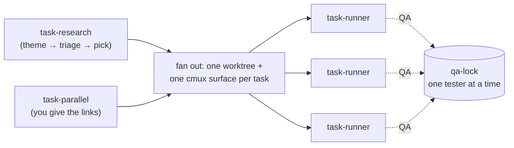
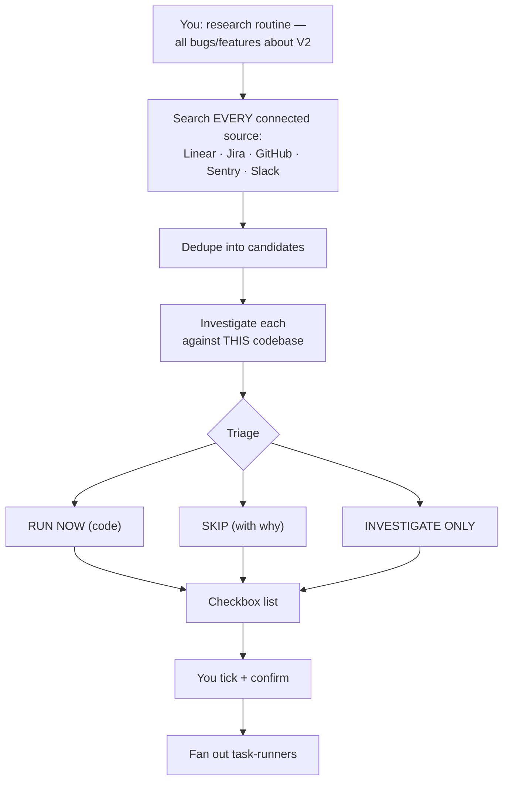
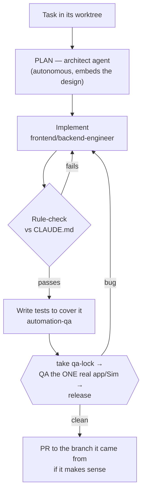

# parallel-tasks

Run several tasks at once, each in its own git worktree and its own cmux surface, without spinning up Docker for any of them. Give it links (**task-parallel**) or a theme to research first (**task-research**), and it fans out one autonomous **task-runner** per task: the *architect* plans it, an engineer builds it, it's checked against your `CLAUDE.md`, tests are written to cover it, and it's QA'd against your **one real running app / one Simulator** — with a shared **QA-lock** making the tasks take turns so only one tests at a time. When a task passes, it opens a PR to the branch it came from. You keep the coordinator open, watch everything in the sidebar, and drop in more tasks whenever you like.

> This is the **simple, no-Docker** path. For full per-task isolation — each task on its own Docker stack + DB + ports, all testing in parallel — use [`loop/`](../loop/README.md) instead. Same worktree/cmux idea; different QA model. Keep both.

## The three pieces

Two entry points (parent, main thread) and one per-task engine (child, in a worktree) — the same split `loop/` has between `investigator` and `loop-engine`.



### task-research — discover by theme, triage, fan out



Say *"run task research routine — all the bugs and features about app V2"*. It searches every tracker and source you have connected for that theme, dedupes (the same bug in Linear and Slack is one candidate), investigates each against your repo, and hands back a checkbox triage. You tick what to run; on your confirm it fans out. Nothing launches until you confirm.

### task-parallel — you already have the links

Give it Linear/Jira URLs (or plain descriptions). It skips discovery and goes straight to the fan-out, then **stays alive** so you can add more: *"also run this one: <link>"* spins up another worktree that joins the same pool automatically.

### task-runner — one task, worktree → tested → PR



Each runner is unattended. It plans **once** with the architect (autonomous — it records best-guess assumptions instead of stopping to grill you), builds, rule-checks against your `CLAUDE.md` (fix + re-check on fail), writes the unit/integration tests that lock the change in, then QA's it. The base branch it PRs to is the branch the worktree was cut from — usually `dev`/`develop` — sanity-checked against your repo's real merge target; if a PR doesn't make sense (investigation-only, a spike, folds into an existing PR) it says so and skips.

## The QA-lock — how tasks take turns on one real app

The tasks build in parallel, but they **test against the same thing** — your one running dev server, or your one iOS Simulator + Xcode. So testing is serialized by a tiny filesystem lock (`qa-lock`), not by a babysitting parent:

- A runner that's ready to QA calls `qa-lock acquire <task-id> --resource <key> --pid $$`. If it's free, it gets it and tests; if someone's testing, it shows *"⏳ waiting for QA"* and retries every 60s.
- The key **identifies the physical target** — `web-<qa-port>` for the shared dev port, `sim-<udid>` for the Simulator — so a web task and a native task test at the same time, and every task sharing one target keys identically (the coordinator assigns the key; runners don't guess).
- Web tasks serve their **own worktree** on a dedicated **qa-port** (separate from the port you run the app on yourself), under a teardown trap, so a task's QA never disturbs the app you're using and never leaks a server onto the shared port.
- Reclaim is by **liveness, not a timer**: the holder's pid is recorded and `kill -0` decides — a crashed holder is reclaimed instantly, a slow-but-alive one (a 40-min native build) is never stolen. Long holds call `qa-lock refresh` to heartbeat; a TTL is only a backstop when the pid can't be checked.

```bash
qa-lock status                              # who's testing the shared app/Sim + who's queued (all targets)
qa-lock whoami                              # holder of every target
qa-lock acquire eng-123 --resource web-3100 --pid $$   # exit 0 = got it, 1 = busy (the runner loops on this)
qa-lock refresh eng-123 --resource web-3100            # heartbeat during a long test
qa-lock release eng-123 --resource web-3100
```

The parent renders the live picture from `cmux read-screen --surface <ref>` per task (what each runner is actually doing) + `qa-lock status` (the QA lane) — no extra plumbing. Note `cmux sidebar-state --json` reports **only the caller's own workspace**, so it can't be used to build this board.

Runners land as **labeled tabs in one pane inside your own workspace**, not as separate sidebar workspaces — see the layout rule in the [root README](../README.md#cmux-cli-facts-these-skills-depend-on).

## What you get

| Piece | Type | Role |
|-------|------|------|
| `skills/task-research/` | skill | discover tasks by theme across all MCPs, triage vs the codebase, fan out on your pick |
| `skills/task-parallel/` | skill | fan out tasks you supply; stays alive to add more on the fly |
| `skills/task-runner/`   | skill | per-task engine: architect plan → implement → CLAUDE.md check → tests → serialized QA → PR |
| `bin/qa-lock.sh` (`qa-lock`) | CLI | the serialization lock — one tester at a time on the shared app/Simulator, keyed by resource |

It **reuses** the rest of claude-tools instead of duplicating it: [`team/`](../team/README.md) (architect, frontend/backend-engineer, automation-qa) to plan/build/test, [`qa/`](../qa/README.md) (manual-qa + qa-run) for the QA step, [`tickets/`](../tickets/README.md) (the `ticket` skill) to create the ticket + PR text, and `cmux` for the surfaces.

## Install

```bash
git clone https://github.com/unisol1020/claude-tools.git ~/.claude-tools 2>/dev/null || git -C ~/.claude-tools pull --ff-only
~/.claude-tools/parallel/install.sh      # symlinks the 3 skills + qa-lock; runs the lock selfcheck
~/.claude-tools/team/install.sh          # architect + engineers + automation-qa   (if not already)
~/.claude-tools/qa/install.sh            # manual-qa + qa-run                        (if not already)
~/.claude-tools/tickets/install.sh       # the ticket skill                          (if not already)
```
Then restart Claude Code once. Requires `git`, `cmux` (macOS) and a connected **tracker** MCP (Linear or Jira); `gh` (or a GitHub MCP) for the PR. Any other MCP — Figma, Sentry, Slack, Notion, a DB MCP — is optional and used when it's there.

## Use it

- **Research a theme:** *"run task research routine — all the bugs and features about app V2"* → tick the triage → confirm → it runs.
- **Run links directly:** *"run these in parallel: https://linear.app/…/ENG-123, https://…/ENG-140"*.
- **Add on the fly:** while they run, *"also run this one: https://linear.app/…/ENG-155"*.
- **Watch it:** the `TASK-<id>` workspaces in the cmux sidebar show each runner's live phase; ask for a board any time and the coordinator renders sidebar + `qa-lock status`.

## Uninstall

```bash
rm ~/.claude/skills/task-research ~/.claude/skills/task-parallel ~/.claude/skills/task-runner ~/.local/bin/qa-lock
```
