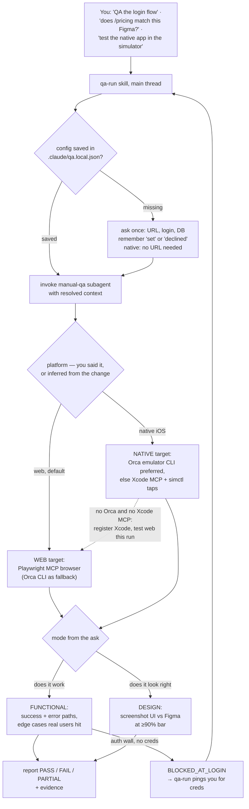

# ai-qa

A QA agent for Claude Code that drives your running app — a **web app in a real browser** or a **native iOS app in the Simulator** — in any local project. You ask "does login work?", "does /pricing match this Figma?", or "test the native app in the simulator" in plain words; it opens the app, clicks through (or screenshots and compares), and reports PASS / FAIL with what it actually saw. It never writes tests and never edits your code.

One agent, **two modes × two platforms**, both picked from how you ask:

- **Functional** — *"does it work?"* It plans like a senior QA — success path, error path, and the edge cases real users hit (double-submit, back mid-flow, expired session, empty/overflowing data, offline) — then drives the app to verify each.
- **Design** — *"does it look right / match Figma?"* It screenshots the running UI and compares it to a Figma frame or reference screenshot at a **≥90% / 1:1** bar, listing every difference.

…and both modes run on either platform:

- **Web** (default) — a real browser via the **Playwright MCP** (required); the **Orca** browser CLI or Claude Desktop as fallback capture.
- **Native iOS** — the booted **Simulator**, driven preferably through the **Orca emulator CLI** (`orca emulator` tap/type/gesture/ax) when Orca is installed; otherwise the **Xcode MCP** (`xcrun mcpbridge`) + `simctl` screenshots + coordinate-mapped taps. Say *"test the native app"* / *"on iOS"* / *"in the simulator"*; if you don't say it, the platform is inferred from where the change lives and what's running. macOS only — with neither Orca nor Xcode MCP it registers Xcode for next time and tests the web build this run.

The first time you QA a project, it asks once for the app's URL, optional login, and an optional read-only DB — then remembers your answers per project (including "no, don't ask again") and stops nagging. A native run skips the URL question entirely — the Simulator is the target.

## How it works

You make a request in the main thread. The `qa-run` skill sets up context — which app, which platform, what URL, login, DB — saving answers so it asks only for what's missing. Then it hands a self-contained brief to the `manual-qa` subagent, which does the actual click-through or screenshot compare and reports back.



The login ping is the one interactive escape hatch: if a flow needs a login but you declined credentials, `manual-qa` stops at the wall and emits `BLOCKED_AT_LOGIN` rather than guessing or faking a pass — `qa-run` then asks you whether to provide creds and re-runs.

`qa-run` also has an **unattended task mode**: a parent orchestrator can inject a per-task URL/port and worktree, and it skips every question and runs straight through.

## What you get

| Piece | Type | Role |
|-------|------|------|
| `agents/manual-qa.md` | global agent | drives the browser **or the iOS Simulator** like a human QA; reports PASS/FAIL; no code edits, no test files |
| `skills/qa-run/` | skill | orchestrator: gathers + remembers per-app URL/login + project DB, then invokes `manual-qa` |
| `skills/playwright-qa/` | skill | the browser playbook — the navigate→snapshot→act→assert loop, network/viewport control, and the Orca fallback |
| `templates/qa.local.json.example` | template | shape of the per-project memory file |

## Install — just send this README to Claude Code

You don't run anything. Paste this file (or its URL) into **Claude Code** and say *"install this"*. Claude does the rest.

> **🤖 Claude Code — if a user sent you this README, install the toolset now. Do not ask setup questions (URL/login/DB are gathered per-project on the first QA run, not at install). Steps:**
>
> 1. **Preflight.** Confirm `git`, `node`/`npx`, and the `claude` CLI are on PATH. If any is missing, stop and tell the user to install it first.
> 2. **Clone (idempotent):**
>    ```bash
>    git clone https://github.com/unisol1020/ai-tools.git ~/.ai-tools 2>/dev/null \
>      || git -C ~/.ai-tools pull --ff-only
>    ```
> 3. **Run the installer:**
>    ```bash
>    bash ~/.ai-tools/qa/install.sh
>    ```
>    It symlinks the `manual-qa` agent + `playwright-qa` and `qa-run` skills into `~/.claude/`, then registers the **Playwright MCP** at user scope (`claude mcp add -s user playwright -- npx @playwright/mcp@latest --headless`) and, on macOS with Xcode installed, the **Xcode MCP** for native iOS QA (`claude mcp add -s user --transport stdio xcode -- xcrun mcpbridge`). The install is idempotent — symlinks mean a later `git pull` updates everything, and an already-registered MCP is left alone.
> 4. **Verify:** `claude mcp get playwright` shows *Connected* (and `claude mcp get xcode` on macOS); `ls -la ~/.claude/agents/manual-qa.md ~/.claude/skills/playwright-qa ~/.claude/skills/qa-run` are symlinks into `~/.ai-tools/qa`.
> 5. **Report back to the user** — confirm it's installed, then explain how it works in this simple step-by-step (paraphrase naturally, keep it short):
>
>    > ✅ **Installed.** Restart Claude Code once so the browser tools and the QA agent load.
>    >
>    > **How to use it — just ask, no commands:**
>    > 1. Start your app's dev server (so there's a URL to open) — or, for the native iOS app, boot a Simulator (Orca preferred if installed; otherwise Xcode open with your project).
>    > 2. Tell me what to check, in plain words:
>    >    - *Does it work?* → "check if login works", "verify checkout", "does the Save button actually save?"
>    >    - *Does it look right?* → "does /pricing match this Figma <link>", "is the header pixel-perfect vs this screenshot?"
>    >    - *On the native app?* → "test the native app", "check it in the simulator", "does the iOS profile screen match Figma?" (macOS; prefers Orca `emulator` control when available, else Xcode MCP — one-time for Xcode fallback: enable Xcode ▸ Settings ▸ Intelligence ▸ "Allow external agents to use Xcode tools" and give your terminal Accessibility permission)
>    > 3. **First time in a project** I'll ask you once (and remember per project): which app + its **URL** (localhost by default; a non-localhost URL is used only at your own risk), whether to use a **login** (or "no, never ask"), and how to verify the **DB** — via a connected MCP (e.g. Supabase), or `psql` with a read-only **DB URL** you provide (local/dev — prod only at your own risk).
>    > 4. I then drive a **real browser** and report **PASS / FAIL** with exactly what I saw. For *works* checks I follow the flow, click, and watch for errors. For *looks-right* checks I screenshot the page and compare it to your Figma/screenshot at a **90%+ / 1:1** bar and list every difference.
>    > 5. For a design check, **give me a Figma link or a screenshot** of the target — if you don't, I'll ask for one.
>    > 6. Your logins live only in a local, git-ignored file (local-dev only) — never committed, never shown back to you.
>    > 7. 💡 I always verify in a **real browser** via the Playwright MCP — including the blast radius around your change and the edge cases a real user hits. If the MCP isn't loaded yet, I drive **Orca**'s browser instead; a plain terminal is fine either way.
>    >
>    > That's it. Try: *"QA the login flow"* or *"does the dashboard match this Figma: <link>"*.
>
> Update later with `git -C ~/.ai-tools pull` (symlinks pick it up). Uninstall: see the bottom of this file.

### Manual install (if you'd rather)

```bash
git clone https://github.com/unisol1020/ai-tools.git ~/.ai-tools
~/.ai-tools/qa/install.sh
```
Then restart Claude Code.

## Requirements

- [Claude Code](https://claude.com/claude-code), Node.js (for `npx`), git.
- **Browser:** the Playwright MCP is required and runs in any terminal. If its tools aren't loaded in a session, the agent falls back to the **Orca** browser CLI (`orca tab create`, `orca snapshot`, `orca click`, `orca screenshot`) — still a real browser.
- First Playwright run downloads Chromium once (~100MB), so the first `browser_navigate` is slow.
- **Native iOS QA (optional):** macOS + a booted Simulator. Prefers the **Orca** CLI (`orca emulator`) when installed; otherwise Xcode 26+ (`xcrun mcpbridge`), the Xcode MCP registered, "Allow external agents to use Xcode tools" enabled, and Accessibility permission for your terminal (System Events taps). Without any of it, web QA works exactly as before.

## Use it (in any project)

1. Start the project's dev server (so there's a URL) — or, for native, boot a Simulator (and have Orca and/or Xcode available).
2. Ask Claude Code, in plain words:
   - **Web:** *"QA the login flow"* · *"verify checkout works"* · *"check if the save button on /settings actually fires a request"* · *"test the dashboard on a mobile viewport"* · *"does the dashboard match this Figma: \<link\>"*
   - **Native iOS:** *"test the native app"* · *"check the signup flow in the simulator"* · *"does the iOS home screen match this Figma: \<link\>"* — say nothing about the platform and it infers one from the change (native/Expo/`ios/` code + a booted Simulator → native; a web app or a handed-in URL → web).
3. **First run in that project**, the `qa-run` skill detects whether it's a single app or a **monorepo** (workspaces / `pnpm-workspace.yaml` / `turbo.json` / `nx.json` / multiple `apps/*`), then asks only for what isn't saved:
   - **Which app** is in scope (only if multiple and ambiguous).
   - **What URL** for that app — pre-filled from the detected dev port, remembered per app (e.g. web-a :3000, web-b :3001). localhost is the default; you can point it at staging/preview/prod, but it warns once that QA exercises a live environment **at your own risk**.
   - **Login** for that app — *Provide* (local-dev only) or *Decline (never ask again)*.
   - **DB verification?** If a DB MCP (Supabase, Postgres, …) is connected, it offers to read via that. Otherwise it asks whether to install a DB MCP, use **`psql`** with a read-only DB URL you provide, or *Decline (never ask again)*. Prefer a local/dev DB; a prod URL is allowed only after you accept the risk, and queries stay read-only.
4. It invokes `manual-qa`, which drives the browser (or the Simulator) and reports **PASS / FAIL / PARTIAL** with evidence. If a check needs login but you declined, it pings you with `BLOCKED_AT_LOGIN` instead of guessing.

## Per-project memory

Your choices live in `<project>/.claude/qa.local.json` (see `templates/qa.local.json.example`). URLs + credentials are **per app** (monorepo-friendly); the DB is project-level:

```jsonc
{
  "version": 1,
  "apps": [
    { "name": "web-a", "url": "http://localhost:3000",
      "credentials": { "status": "set", "loginUrl": "...", "username": "...", "password": "..." } },
    { "name": "web-b", "url": "http://localhost:3001", "credentials": { "status": "declined" } }
  ],
  "db": { "status": "set|declined|no-mcp", "access": "mcp|psql", "tool": "mcp__<server>__<readonly_sql_tool> | psql", "url": "...", "env": "local|dev|prod" }
}
```

`status` is the memory: `set` = use it · `declined` = never ask again · `no-mcp` = no DB MCP present. Change your mind by editing (or deleting) the file.

### ⚠️ Credentials & privacy

- `qa.local.json` holds **local-dev credentials**, so it's **gitignored** and must never be committed. `qa-run` adds `/.claude/qa.local.json` to your project's `.gitignore` before writing anything.
- **Local-dev by default; non-localhost is your call.** You can aim QA at staging/preview/prod, but only after a one-time warning that it drives a live, possibly shared environment (forms submitted, writes triggered, real services hit) — all risk on you. The agent never prints passwords in reports.
- This repo contains **no secrets** — only the tooling and a placeholder template.

## How the capture tools split

| Tool | Used for |
|------|----------|
| **Playwright MCP** | web QA in a real browser — flows, forms, forced error states (network mocking), mobile/offline/geo, screenshots. Required; works everywhere. |
| **Orca** browser CLI (optional) | fallback real browser when the Playwright MCP tools aren't loaded — `orca tab create`, `orca snapshot`, `orca click`, `orca screenshot`, `orca set offline\|device`, `orca storage local set`. |
| **Orca** emulator CLI (preferred for native) | **native iOS QA** when Orca is installed — `orca emulator devices\|attach\|tap\|type\|gesture\|button\|ax` (normalized 0..1 coords); use `xcrun simctl` alongside for install/launch/screenshot. |
| **Xcode MCP** (`xcrun mcpbridge`) + `simctl` | **native iOS QA fallback** — build/launch on the booted Simulator, `simctl io screenshot`, coordinate-mapped taps/keystrokes via System Events, `simctl spawn log stream`. macOS + Xcode 26+. |
| **Maestro** | native **Android** / cross-platform flow scripting — not part of this toolset; use it directly. |

For design mode on web, `manual-qa` captures the running UI with the first available of: Playwright MCP screenshot → Orca browser CLI → Claude Desktop browser → Chrome-connected browser → else it tells you to enable one. On native, a Simulator screenshot (`simctl` or Orca) *is* the capture, compared to the Figma frame at the same ≥90% / 1:1 bar.

### Native iOS — setup

**Preferred:** install [Orca](https://orca.computer) so `orca` is on PATH with emulator support (`orca emulator --help`). Agents attach a device and drive taps/type/gestures without Accessibility clicks.

**Fallback (Xcode):** the installer registers the Xcode MCP for you on macOS. Two things only you can do:

1. **Xcode ▸ Settings ▸ Intelligence ▸ "Allow external agents to use Xcode tools"** — enable it once (without it the bridge just hangs).
2. **Grant your terminal Accessibility permission** (System Settings ▸ Privacy & Security ▸ Accessibility) so System Events taps/keystrokes can be sent into the Simulator when Orca isn't available.

At QA time, keep a **booted Simulator** (`orca emulator devices --json` or `xcrun simctl list devices booted`) — the agent attaches/boots one and builds/launches the app if needed, but prefers whatever's already running (it won't kill your metro/Expo session). For Xcode-path builds, keep **Xcode open with your project**.

## Override per project

A project can ship its own `.claude/agents/manual-qa.md` to specialize the agent (project URLs, a DB cross-check tool, extra conventions). A project-scoped agent of the same name takes precedence over this global one — that's intended.

## Uninstall

```bash
rm ~/.claude/agents/manual-qa.md ~/.claude/skills/playwright-qa ~/.claude/skills/qa-run
claude mcp remove playwright -s user
claude mcp remove xcode -s user   # only if you installed native iOS QA
rm -rf ~/.ai-tools
```
